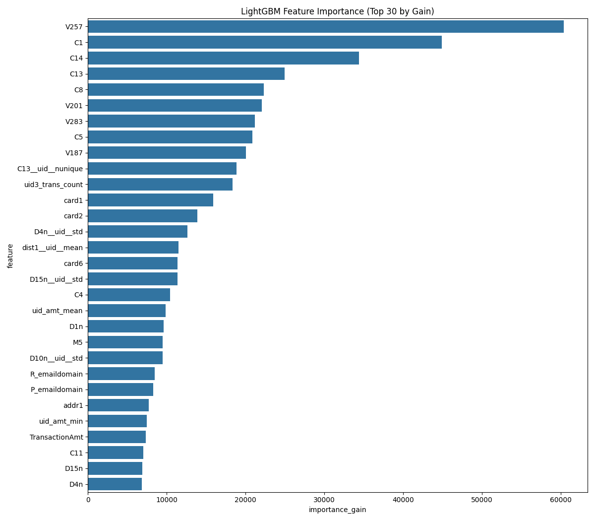
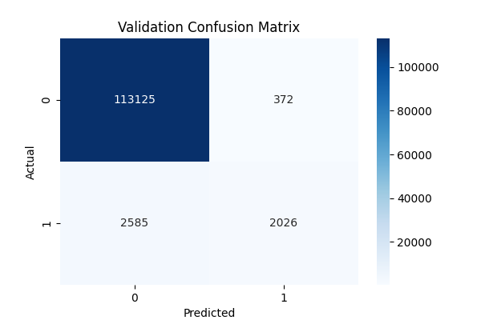

# MLOps Project: Real-time Fraud Detection System

## 1. Project Architecture

**(Your architecture diagram image will go here)**

---

## 2. Introduction

### 2.1. Project Goal
The primary objective of this MLOps project is to design, develop, and deploy an end-to-end machine learning system capable of detecting fraudulent financial transactions in real-time. This encompasses the entire machine learning lifecycle, including automated data preprocessing, robust feature engineering, model training, comprehensive experiment tracking, and the deployment of the trained model as a scalable, containerized web service with Continuous Integration and Continuous Deployment (CI/CD) pipelines.

### 2.2. Technologies Used
This project leverages a modern stack of MLOps tools and technologies:
* **Programming Language:** Python 3.11
* **Core Data Science Libraries:** Pandas, NumPy, Scikit-learn, LightGBM
* **Visualization:** Matplotlib, Seaborn
* **Model & Preprocessor Persistence:** Joblib
* **Experiment Tracking (Local):** MLflow
* **Web Framework & API:** Flask
* **Containerization:** Docker
* **Cloud Platform:** Microsoft Azure
    * **Azure App Service for Containers:** Hosting the containerized Flask API.
    * **Azure Container Registry (ACR):** Storing Docker images.
    * **Azure Application Insights:** Application performance monitoring and logging.
* **CI/CD:** GitHub Actions
* **Version Control:** Git & GitHub

### 2.3. Main Functionalities
The system implements the following key functionalities:
1.  **Automated Training Pipeline (`run_pipeline.py`):**
    * Loads and merges raw transaction and identity data.
    * Performs data preprocessing, including datetime feature extraction, M-feature mapping, string cleaning, and label encoding for categorical features.
    * Conducts extensive feature engineering, such as UID creation, D-normalized features, C-column aggregations, V-column PCA, and M-flag aggregates.
    * Trains a LightGBM model for fraud classification.
    * Logs training parameters, evaluation metrics (AUC, LogLoss, F1-score, Precision, Recall), and various artifacts (trained model, preprocessors, feature lists, evaluation plots) locally using MLflow.
    * Saves the trained model, preprocessors, and other essential artifacts for deployment.
2.  **Real-time Fraud Prediction API (`src/predict.py` with Flask):**
    * Exposes a RESTful API endpoint (`/api/predict`) that accepts transaction details in JSON format.
    * Applies the same preprocessing and feature engineering transformations to the input data as used during training, ensuring consistency.
    * Loads the persisted LightGBM model and associated preprocessors.
    * Returns a JSON response containing the fraud probability and a binary fraud/not-fraud prediction.
    * Optionally, serves a simple HTML web interface via the `/` route for manual data entry and prediction.
3.  **Containerized Deployment on Azure App Service:**
    * The Flask API, along with all its dependencies, model, and preprocessors, is containerized using Docker.
    * The resulting Docker image is stored in Azure Container Registry (ACR).
    * The application is deployed and hosted on Azure App Service for Containers, providing a scalable and managed environment for the API.
4.  **CI/CD with GitHub Actions:**
    * An automated workflow is triggered upon pushing code changes to the `main` branch of the GitHub repository.
    * The workflow automatically builds a new Docker image.
    * The new Docker image is automatically pushed to ACR.
    * The Azure App Service is automatically updated to use the latest image from ACR, ensuring continuous deployment.
5.  **Monitoring and Logging:**
    * Integration with Azure Application Insights for real-time monitoring of the deployed application's performance, availability, error rates, and for querying application logs (including custom traces from the Python code).
    * Local MLflow UI for reviewing, comparing, and analyzing past training experiments.

---

## 3. Project Structure


**Folder and File Descriptions:**

* **`.github/workflows/`**: Contains the GitHub Actions workflow YAML file (`deploy-to-azure-app-service.yml`) that defines the CI/CD pipeline for building the Docker image, pushing it to ACR, and deploying it to Azure App Service.
* **`artifacts/`**: Stores non-model outputs generated by the training pipeline. This includes:
    * `confusion_matrix_valid.png`: Visualization of the model's performance on the validation set.
    * `feature_importance.png`: Plot showing the most important features for the model.
    * `final_training_features.json`: A JSON file listing the exact features used to train the model, crucial for ensuring consistency during inference.
    * `model_info.json`: A JSON file containing metadata about the trained model, such as MLflow run ID, training parameters, and key performance metrics.
* **`data/raw/`**: Designated directory for storing the original, unaltered input datasets (e.g., `train_transaction.csv`, `train_identity.csv`). These files are typically large and are not committed to the Git repository.
* **`data/processed/`**: Intended for storing dataframes after preprocessing and feature engineering steps, ready for model training (e.g., `final_processed_training_data.parquet`). Also generally not committed to Git.
* **`env/`**: Contains environment configuration files. `environment_scoring.yml` was likely used for defining a Conda environment for a previous Azure Machine Learning deployment approach.
* **`mlruns/`**: The default local directory where MLflow stores all experiment tracking data, including parameters, metrics, tags, and artifacts for each run. This directory is excluded from Git.
* **`models/`**: This critical directory stores the serialized trained machine learning model (`lgbm_model.joblib`) and any preprocessor objects (`label_encoders.joblib`, `pca_v_transformer.joblib`, `scaler_v_transformer.joblib`) that were fitted during the training pipeline and are necessary for transforming new data at inference time.
* **`notebooks/`**: Contains Jupyter notebooks (`fraud_ml_ops.ipynb`) used for initial data exploration, analysis, experimentation, and iterative model development.
* **`src/`**: The primary directory containing all Python source code for the project.
    * `__init__.py`: Marks the `src` directory as a Python package.
    * `config.py`: Defines global configuration variables, file paths, model hyperparameters, and other settings used throughout the project.
    * `data_preprocessing.py`: Houses functions responsible for loading raw data, cleaning it, handling missing values, and performing initial transformations like datetime processing and categorical encoding.
    * `feature_engineering.py`: Contains scripts for generating new, informative features from the preprocessed data to improve model performance.
    * `predict.py`: Implements the Flask web application. It loads the trained model and preprocessors, defines API endpoints (like `/api/predict`) for receiving input data, processes the input, makes predictions, and returns the results. It also serves the HTML interface.
    * `train.py`: Includes the core logic for training the LightGBM model, performing model evaluation on validation/test sets, and logging all relevant experiment details to MLflow locally.
    * `utils.py`: A collection of utility functions that support various tasks across the project, such as memory optimization.
* **`templates/`**: Contains HTML files (e.g., `index.html`) used by the Flask application to render a web-based user interface for making predictions.
* **`tests/`**: (To be developed) This directory will contain all unit tests and integration tests to ensure the correctness and reliability of the codebase.
* **Root Directory Files:**
    * `.dockerignore`: Specifies which files and directories should be excluded from the Docker build context to keep the image lean.
    * `.gitignore`: Lists files and directories that Git should ignore (e.g., virtual environments, local data, MLflow runs, sensitive configuration files).
    * `config.json`: Contains configuration details for connecting to an Azure Machine Learning workspace. *This file should be in `.gitignore` if it holds sensitive subscription or workspace IDs to avoid committing them to a public repository.*
    * `create_aml_scoring_env.py`, `deploy_to_aml_endpoint.py`, `register_aml_deployment_package.py`: These Python scripts were part of the initial MLOps strategy focused on deploying the model using Azure Machine Learning managed online endpoints. They handle the creation of scoring environments, registration of deployment packages, and deployment to AML endpoints. (Mention if these are now considered legacy or an alternative deployment path for specific scenarios).
    * `Dockerfile`: Contains the set of instructions for Docker to build the application image. It specifies the base Python image, copies necessary files (source code, models, artifacts, requirements), installs dependencies, and defines the command to run the Flask application.
    * `README.md`: This file, providing a comprehensive overview of the project.
    * `requirements.txt`: Lists all Python libraries and their versions required to run the project, ensuring a reproducible environment.
    * `run_pipeline.py`: The main executable script that orchestrates the entire local training pipeline. It calls functions from `data_preprocessing.py`, `feature_engineering.py`, and `train.py` in sequence to process data and train the model.
 

## 4. Installation, Setup, and Deployment Workflow

This section provides a concise guide to set up the project, run the training pipeline, and deploy the application to **Azure App Service with CI/CD**.  
> ⚙️ **Requirement**: Python 3.11

---

### I. **Local Development & Training**

**1. Clone Repository & Setup Environment:**
* `git clone https://github.com/bachdang0311/fraud_detection_mlops.git && cd fraud_detection_mlops`
* Create and activate a Python virtual environment (e.g., python -m venv venv, then activate).
* Install dependencies: `pip install -r requirements.txt` (ensure `opencensus-ext-azure` is included).


**2. Prepare Data:**

* Download `train_transaction.csv` and `train_identity.csv`.
* Place them in the `data/raw/` directory.

**3. Run Training Pipeline:**
* Thực thi: `python run_pipeline.py`
* Lệnh này sẽ tạo ra:
    * Các tệp model và preprocessor trong `models/`.
    * Các artifact (danh sách feature, thông tin, biểu đồ) trong `artifacts/`.
    * Log thử nghiệm MLflow trong `mlruns/`.

**4. Review Experiments (Optional):**
* Chạy `mlflow ui`.
* Truy cập `http://localhost:5000`.

**5. Test API Locally (Optional):**
* Chạy `python -m src.predict`.
* Kiểm tra `http://localhost:8080/api/predict` bằng Postman hoặc `curl`.

**6. Build Docker Image Locally (Recommended before first cloud push):**
* `docker build -t fraud_detector_app_local:latest .`
* (Tùy chọn) Kiểm tra với `docker run -p 8080:8080 -e PORT=8080 fraud_detector_app_local:latest`

### II. **Azure Resource Provisioning (One-time Manual Setup)**
* (Đảm bảo Azure CLI đã được cài đặt và đăng nhập: `az login`, `az account set ...`)

**7. Register Azure Providers (If needed):**
* `az provider register --namespace Microsoft.Web --wait`
* `az provider register --namespace Microsoft.ContainerRegistry --wait`

**8. Create Azure Resources (if they don't exist, use your actual names and region like `westus2`):**
```bash
# Resource Group (ví dụ: MyFraudRgAppService)
az group create --name <YourResourceGroup> --location <YourLocation>

# Container Registry (ACR) (ví dụ: myfraudappacrhqbdz1)
az acr create --resource-group <YourResourceGroup> --name <YourUniqueACRName> --sku Basic --admin-enabled true

# App Service Plan (ví dụ: myFraudAppPlanWestprsxnj, SKU B1, Linux)
az appservice plan create --name <YourAppServicePlanName> --resource-group <YourResourceGroup> --sku B1 --is-linux --location <YourLocation>

# Web App for Containers (ví dụ: myfrauddetectorapik0jegk)
az webapp create --resource-group <YourResourceGroup> --plan <YourAppServicePlanName> --name <YourUniqueWebAppName> --deployment-container-image-name ""
az webapp config appsettings set --resource-group <YourResourceGroup> --name <YourUniqueWebAppName> --settings WEBSITES_PORT=8080
```

**9. Create Azure Resource Group**
```bash
$RESOURCE_GROUP="MyFraudRgAppService"
$LOCATION="westus2"
az group create --name $RESOURCE_GROUP --location $LOCATION
```
**10. Create Azure Container Registry (ACR)**
```bash
$ACR_NAME="myfraudappacrhqbdz1" # Replace with your unique ACR name
az acr create --resource-group $RESOURCE_GROUP --name $ACR_NAME --sku Basic --admin-enabled true
```

**11.  Create Azure App Service Plan**
```bash
$APPSERVICE_PLAN_NAME="myFraudAppPlanWestprsxnj" # Replace
az appservice plan create --name $APPSERVICE_PLAN_NAME --resource-group $RESOURCE_GROUP --sku B1 --is-linux --location $LOCATION
```

**12. Create Web App for Containers (Azure App Service)**
```bash
$WEBAPP_NAME="myfrauddetectorapik0jegk" # Replace with your unique Web App name
# CI/CD will set the actual image, so it can be created with a placeholder initially.
az webapp create --resource-group $RESOURCE_GROUP `
                 --plan $APPSERVICE_PLAN_NAME `
                 --name $WEBAPP_NAME `
                 --deployment-container-image-name "" # Or a placeholder
```

**13. Enable Application Insights for Monitoring:**
* In Azure Portal: Navigate to your Web App -> "Application Insights" -> "Turn on Application Insights". Link or create a new resource.

### III. **CI/CD Setup with GitHub Actions (One-time Setup)**

**14. Prepare Azure Credentials for GitHub Actions:**
* **ACR Admin Credentials:** From ACR -> "Access keys" -> Enable Admin user -> Copy Login server, Username, Password.
* **App Service Publish Profile:** From Web App -> "Get publish profile" -> Download `.PublishSettings` file -> Copy entire XML content.

**15. Add Credentials to GitHub Secrets:**
* In your GitHub repo: "Settings" -> "Secrets and variables" -> "Actions" -> "New repository secret".
* Add:
    * `ACR_LOGIN_SERVER`
    * `ACR_USERNAME`
    * `ACR_PASSWORD`
    * `AZURE_WEBAPP_PUBLISH_PROFILE`
    * `AZURE_APP_NAME` (your Web App name)
    * `IMAGE_NAME` (e.g., `fraud_detector_app`)

**16. Create GitHub Actions Workflow File:**
* Create `.github/workflows/deploy-to-azure-app-service.yml`.
* Paste the previously discussed YAML content (using ACR Admin User & Publish Profile).

**17. Commit & Push Project to GitHub:**
* Ensure all necessary files are present (Dockerfile, `src/`, `models/`, `artifacts/`, workflow file, etc.).
* Commit any uncommitted changes (especially model files if following "commit artifacts to Git" approach and the new workflow file).
    ```bash
    git add .
    git commit -m "Configure CI/CD with GitHub Actions"
    git push origin main
    ```

### IV. **Automated Deployment via CI/CD (Ongoing)**

**18. Develop & Push Changes:**
* Make code modifications or re-run `python run_pipeline.py` to update `models/`artifacts.
* Commit all relevant changes (including new model/artifact files) to Git.
* `git push origin main`

**19. Monitor CI/CD & Verify Deployment:**
* The GitHub Actions workflow will automatically build, push to ACR, and deploy to Azure App Service. Monitor this in your GitHub repo's "Actions" tab.
* After successful deployment, test your Web App URL and API endpoints.
* Check Azure Application Insights for logs and performance.
---
## 5. **Model Performance & Artifacts**
(This section should remain largely the same as before, ensure you update the metrics with your latest best model and include clear screenshots from your MLflow UI.)

The fraud detection model is a LightGBM classifier. Its performance and associated artifacts are tracked locally using MLflow.

**5.1. Key Performance Metrics (Example from a training run)**
* Validation Set AUC: `[Insert Your Actual Validation AUC, e.g., 0.9253]`
* Validation Set LogLoss: `[Insert Your Actual Validation LogLoss, e.g., 0.2875]`
* Validation Set F1-Score: `[Insert Your Actual Validation F1-Score, e.g., 0.6890]`
* (If applicable) Test Set AUC: `[Insert Your Actual Test AUC]`

**5.2. MLflow Artifacts**
Each training run executed via `run_pipeline.py` logs comprehensive information to the local `mlruns/` directory, viewable through the MLflow UI (`mlflow ui` command).

* **Trained Model & Preprocessors:**
    * The serialized LightGBM model (`lgbm_model.joblib`).
    * Preprocessor objects: `label_encoders.joblib`, `scaler_v_transformer.joblib`, `pca_v_transformer.joblib`.
    * These are also logged within the MLflow run under an "lgbm_model_mlflow" directory (for the MLflow model format) and a "preprocessors" directory.
* **Screenshot:** MLflow UI showing the artifact view of a selected run, highlighting model and preprocessor files.
    
* **Feature Importance Plot:** Visualizes the most influential features for the model.
     (Ensure this file is in your `artifacts/` folder and committed, or update path if stored elsewhere by MLflow and you want to show that one).
* **Confusion Matrix (Validation Set):** Illustrates classification performance.
     (Ensure this file is in your `artifacts/` folder and committed).
* **Supporting Files:**
    * `final_training_features.json`: List of features used for model training.
    * `model_info.json`: Summary of the run, including parameters and metrics.
* **Screenshot:** MLflow UI showing the parameters and metrics tabs for a selected run.
    

---
## 6. **Unit Tests**
(This section describes the planned or implemented unit tests. You need to write these tests in a `tests/` directory using `pytest`.)

Unit tests are planned to ensure the reliability and correctness of individual components within the MLOps pipeline. The `pytest` framework will be utilized.

**Planned Test Coverage:** (Update this as you implement tests)

* **Data Preprocessing (`tests/test_data_preprocessing.py`):**
    * `test_load_and_merge_data()`: Verify correct data loading and merging.
    * `test_preprocess_datetime()`: Ensure accurate datetime feature creation.
    * `test_label_encode_categorical_features()`: Check fitting and transformation logic, including handling of NaNs and unseen values.
* **Feature Engineering (`tests/test_feature_engineering.py`):**
    * `test_create_uid_features()`: Confirm correct generation of UID features.
    * `test_create_v_features_pca()`: Validate PCA transformation and preprocessor saving/loading.
* **Prediction API (`tests/test_predict_api.py` - using Flask's test client):**
    * `test_api_predict_success()`: Test `/api/predict` with valid input, expect 200 OK and correct response structure.
    * `test_api_predict_invalid_input()`: Test with invalid/missing input, expect appropriate error codes.
    * `test_html_form_submission()`: (If applicable) Test the `/` route with form data.
* **Utilities (`tests/test_utils.py`):**
    * `test_reduce_memory_usage()`: Verify memory reduction functionality.

(For each implemented test, briefly describe: What it tests, sample input (if simple), and expected outcome/assertions.)

---
## 7. **Future Development and Next Steps**
This project establishes a foundational MLOps system. Future enhancements could include:

* **Implement Comprehensive Test Suite:** Prioritize writing and integrating the unit and integration tests outlined above into the CI/CD pipeline.
* **Advanced Model Management:** Integrate with Azure Machine Learning Model Registry for robust versioning and management of models, and update CI/CD to pull models from there.
* **Enhanced CI/CD Security:** Transition to OpenID Connect (OIDC) for GitHub Actions to Azure authentication and use Managed Identities for App Service to ACR communication.
* **Model Performance Monitoring:** Implement a system to track the deployed model's performance on live data to detect drift and trigger retraining.
* **Automated Retraining Pipeline:** Develop a pipeline for automated model retraining based on new data or performance degradation.
* **Hyperparameter Optimization:** Integrate tools like Optuna or Weights & Biases Sweeps for systematic hyperparameter tuning.
* **Scalability and Load Testing:** Conduct load tests and optimize App Service Plan SKU and auto-scaling rules.
* **Feature Store:** For more complex scenarios, explore a dedicated feature store.
